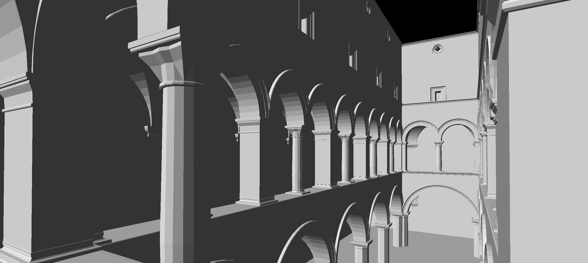

# 📺 Computer Graphics Engine

This project was developed for the Computer Graphics course, part of the third-year curriculum in the Software Engineering bachelor's program at the University of Minho. It focuses on implementing an OpenGL based rendering engine capable of loading and displaying complex scenes from a custom XML format. The final demo showcases a dynamic solar system with configurable visual and simulation settings via an ImGui interface.

This project obtained a final grade of **19.2/20** 💎

## 🛠️ Usage

This project requires the following dependencies to be installed:

- [vcpkg](https://vcpkg.io/en/getting-started)
- [CMake](https://cmake.org/download/)

### 🪟 Windows

To build both applications (generator and engine):

```
$ .\scripts\build.bat
```

To run one of the applications:

```
$ .\scripts\run.bat [engine|generator]
```